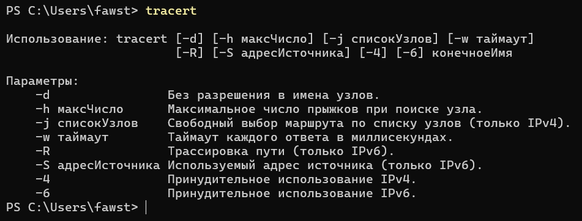
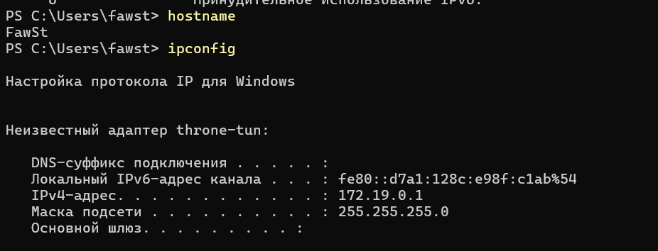
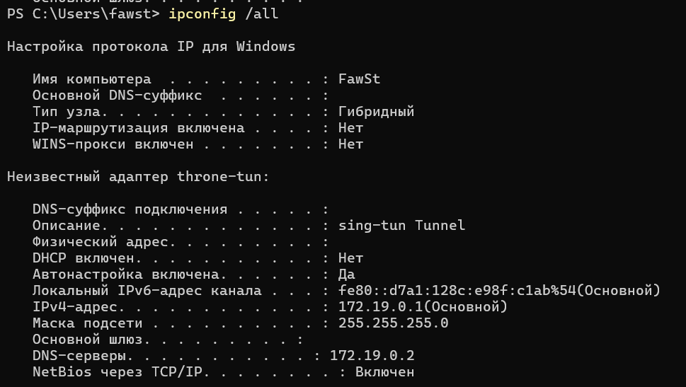
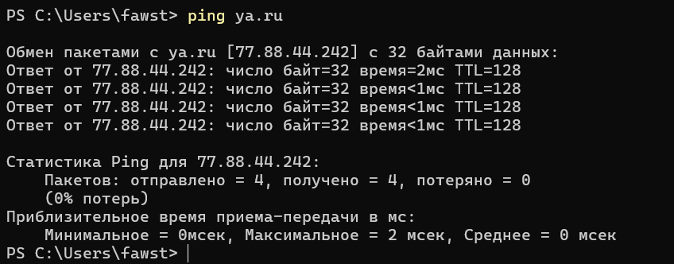
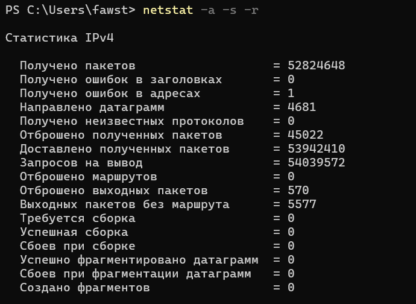
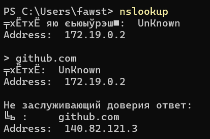
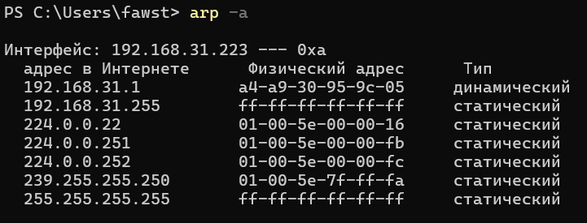
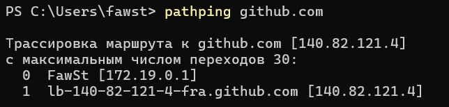

# Лабораторная работа № 3

## Знакомство и применение сетевых утилит Windows для определения параметров и работоспособности сети

### 1. Список опций утилиты tracert

```cmd
tracert
```



```cmd
hostname
```
```cmd
ipconfig
ipconfig /all
```



```cmd
net view
```


```cmd
ping ya.ru
```


```cmd
netstat -a -s -r
```


```cmd
tracert ya.ru
```


```cmd
net use
```


```cmd
nslookup
```


```cmd
arp -a
```


```cmd
pathping github.com
```



### ipconfig /all

Мы получаем следующие данные:
Имя узла (Host Name)
Основной DNS-суффикс и суффикс подключения – доменные имена, используемые при разрешении коротких имён.
Тип узла (Node Type)
Для каждого адаптера: MAC, включён ли DHCP, автонастройка, IPv4-адрес, маска подсети, основной шлюз, DNS-серверы, время аренды DHCP (если включено) и другие параметры (иногда).

### Дополнительная информация утилиты pathping по сравнению с ping и tracert

ping — проверяет, работает ли связь в целом, но не показывает место сбоя.
tracert — показывает весь маршрут по шагам, но плохо определяет потери данных.
pathping — сначала строит маршрут, а затем долго тестирует каждый шаг, точно выявляя проблемное место. Она же самая полезная утилита, так как она точечно находит локацию сетевых потерь.  
