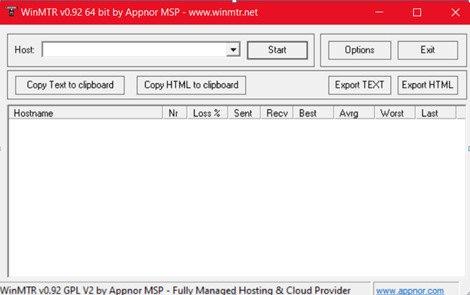
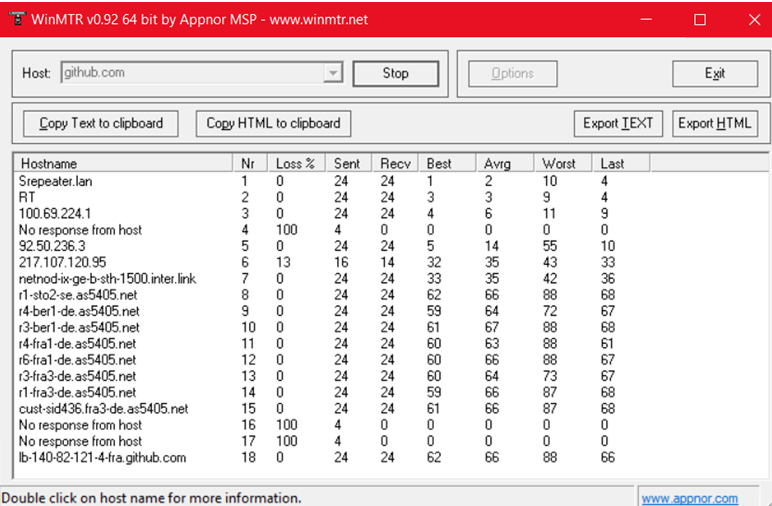
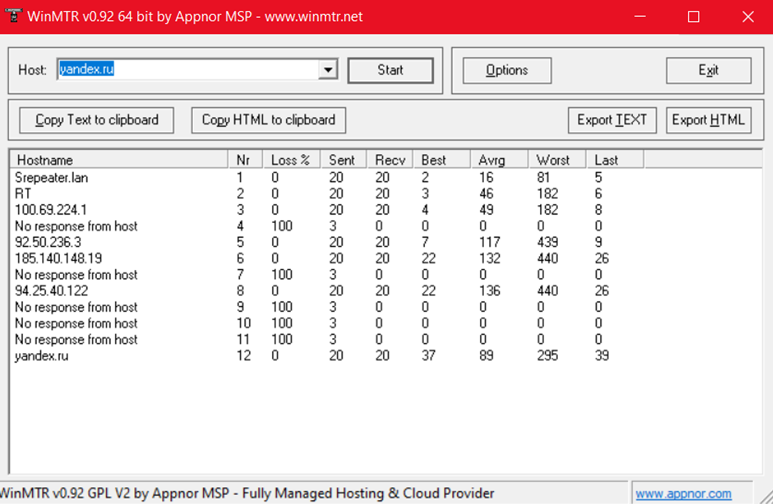
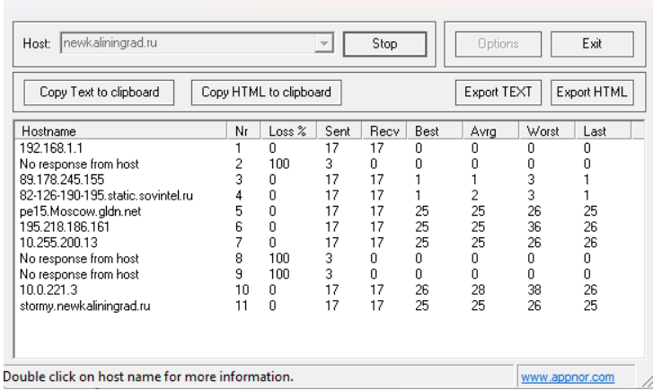

# Лабораторная работа № 4

## Проверка качества  интернет соединения при помощи утилиты WinMTR№1

> 
> 
> 
> 

|------------------------------------------------------------------------------------------|

|                                      WinMTR statistics                                   |

|                       Host              -   %  | Sent | Recv | Best | Avrg | Wrst | Last |

|------------------------------------------------|------|------|------|------|------|------|

|                           Srepeater.lan -    0 |   20 |   20 |    1 |    3 |    9 |    2 |

|                                      RT -    0 |   20 |   20 |    3 |    6 |   14 |    7 |

|                            100.69.224.1 -    0 |   20 |   20 |    5 |    9 |   23 |    7 |

|                   No response from host -  100 |    4 |    0 |    0 |    0 |    0 |    0 |

|                             92.50.236.3 -    0 |   20 |   20 |    5 |   12 |   44 |    7 |

|                          185.140.148.19 -    0 |   20 |   20 |   20 |   23 |   31 |   23 |

|                   No response from host -  100 |    4 |    0 |    0 |    0 |    0 |    0 |

|                           95.167.223.34 -    0 |   20 |   20 |   26 |   32 |   70 |   30 |

|                   No response from host -  100 |    4 |    0 |    0 |    0 |    0 |    0 |

|                   No response from host -  100 |    4 |    0 |    0 |    0 |    0 |    0 |

|                   No response from host -  100 |    4 |    0 |    0 |    0 |    0 |    0 |

|                   No response from host -  100 |    4 |    0 |    0 |    0 |    0 |    0 |

|                stormy.newkaliningrad.ru -    0 |   20 |   20 |   28 |   33 |   68 |   29 |

|________________________________________________|______|______|______|______|______|______|

   WinMTR v0.92 GPL V2 by Appnor MSP - Fully Managed Hosting & Cloud Provider

Отчёт по трассировке до newkaliningrad.ru
Потерь нет. По пути есть несколько узлов, которые не отвечают на запросы. Самый долгий прыжок - около 33 мс в среднем, максимум 68 мс. Соединение стабильное.

|------------------------------------------------------------------------------------------|

|                                      WinMTR statistics                                   |

|                       Host              -   %  | Sent | Recv | Best | Avrg | Wrst | Last |

|------------------------------------------------|------|------|------|------|------|------|

|                           Srepeater.lan -    0 |   17 |   17 |    2 |    3 |    7 |    2 |

|                                      RT -    0 |   17 |   17 |    3 |    6 |    9 |    4 |

|                            100.69.224.1 -    0 |   17 |   17 |    5 |    8 |   13 |    5 |

|                   No response from host -  100 |    4 |    0 |    0 |    0 |    0 |    0 |

|                             92.50.236.3 -    0 |   17 |   17 |    5 |    9 |   14 |    5 |

|                          185.140.148.19 -    0 |   17 |   17 |   22 |   25 |   31 |   24 |

|                   No response from host -  100 |    4 |    0 |    0 |    0 |    0 |    0 |

|                            94.25.40.122 -    0 |   17 |   17 |   23 |   27 |   37 |   32 |

|                   No response from host -  100 |    4 |    0 |    0 |    0 |    0 |    0 |

|                   No response from host -  100 |    4 |    0 |    0 |    0 |    0 |    0 |

|                   No response from host -  100 |    4 |    0 |    0 |    0 |    0 |    0 |

|                               yandex.ru -    0 |   17 |   17 |   36 |   42 |   71 |   39 |

|________________________________________________|______|______|______|______|______|______|

   WinMTR v0.92 GPL V2 by Appnor MSP - Fully Managed Hosting & Cloud Provider
   
Отчёт по трассировке до yandex.ru
Потерь нет. По пути есть несколько узлов, которые не отвечают на запросы. Среднее время ответа от последнего узла - 42 мс, бывает до 71 мс. Соединение стабильное.

|------------------------------------------------------------------------------------------|

|                                      WinMTR statistics                                   |

|                       Host              -   %  | Sent | Recv | Best | Avrg | Wrst | Last |

|------------------------------------------------|------|------|------|------|------|------|

|                           Srepeater.lan -    0 |   19 |   19 |    1 |    3 |    9 |    4 |

|                                      RT -    0 |   19 |   19 |    2 |    5 |   13 |    7 |

|                            100.69.224.1 -    0 |   19 |   19 |    5 |    7 |   16 |    8 |

|                   No response from host -  100 |    4 |    0 |    0 |    0 |    0 |    0 |

|                             92.50.236.3 -    0 |   19 |   19 |    5 |   11 |   37 |   10 |

|                          217.107.120.95 -    7 |   15 |   14 |    0 |   34 |   44 |   34 |

|      netnod-ix-ge-b-sth-1500.inter.link -    0 |   19 |   19 |   40 |   42 |   53 |   43 |

|                   r1-sto2-se.as5405.net -    0 |   19 |   19 |   61 |   67 |   94 |   66 |

|                   r4-ber1-de.as5405.net -    0 |   19 |   19 |   60 |   67 |   94 |   66 |

|                   r3-ber1-de.as5405.net -    0 |   19 |   19 |   60 |   68 |  108 |   67 |

|                   r4-fra1-de.as5405.net -    0 |   19 |   19 |   62 |   69 |  112 |   67 |

|                   r6-fra1-de.as5405.net -    0 |   19 |   19 |   61 |   68 |  112 |   63 |

|                   r3-fra3-de.as5405.net -    0 |   19 |   19 |   60 |   67 |  112 |   63 |

|                   r1-fra3-de.as5405.net -    0 |   19 |   19 |   62 |   68 |  107 |   66 |

|          cust-sid436.fra3-de.as5405.net -    0 |   19 |   19 |   60 |   70 |  112 |   64 |

|                   No response from host -  100 |    4 |    0 |    0 |    0 |    0 |    0 |

|                   No response from host -  100 |    4 |    0 |    0 |    0 |    0 |    0 |

|          lb-140-82-121-3-fra.github.com -    0 |   19 |   19 |   61 |   66 |   82 |   66 |

|________________________________________________|______|______|______|______|______|______|

   WinMTR v0.92 GPL V2 by Appnor MSP - Fully Managed Hosting & Cloud Provider

Отчёт по трассировке до github.com
Потерь нет. По пути есть несколько узлов, которые не отвечают на запросы. Средняя задержка до GitHub - 66 мс. Соединение стабильное.

